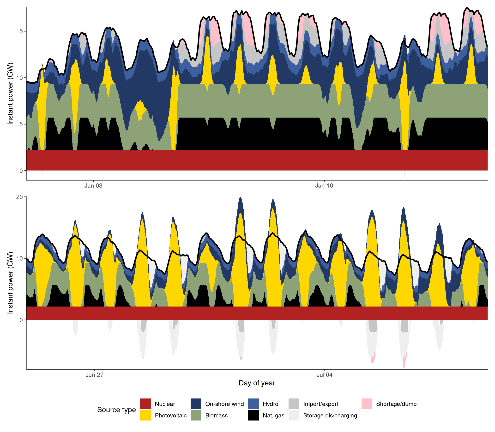

# Czech electricity model

This project aims to construct an open-source model of the Czech electricity grid.

The basic features of the model currently include:

-   Calculating the generation adequacy for each hour of the year.
-   Calculating the generation of intermittent sources (photoltaic, wind) according to their assumed hourly capacity factor (supplied as part of input).
-   Dispatching flexible sources, storage and import/export in a specified merit order.
    -   The default merit order is as follows: baseload and intermittent sources (nuclear, PV, wind) → storage → hydro → biomass → natural gas → cross-border import.
-   Redirecting of surplus generation to storage units (pumped water, batteries, power-to-gas) and discharging them when demand rises.
-   Basic modelling of power plant self-consumption, storage inefficiency (only at charging time at the moment) and transmission/distribution losses in the grid.
-   Configuration of grid elements and properties using a YAML file.
-   Export of hourly data to CSV.

## Example output

The basic output of the model runner is the following table summarising the key flows in the model:

    Total net generation:         107,141,867 MWh
    Total flexible generation:     46,625,280 MWh
    Total inflexible generation:   60,516,587 MWh
    Total charging consumption:     2,880,642 MWh
    Total discharging:              1,986,646 MWh
    Total export:                     540,868 MWh
    Total import:                   3,189,288 MWh
    Total dump:                       274,023 MWh
    Total shortage:                 1,473,203 MWh

    Total consumption:            102,864,123 MWh

    Model output written to ‘sandbox/model_output.csv’

The runner also generates a CSV file with the generation/output of each electricity source in every hour of the modelled period. This data can be used to plot the time series of demand, power generation, import/export, etc., such as the following:

